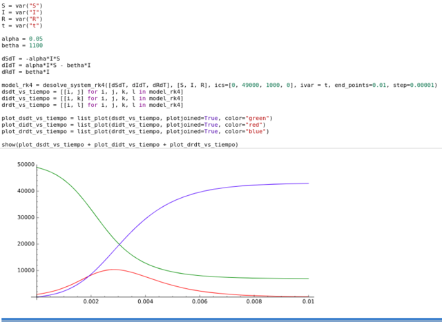
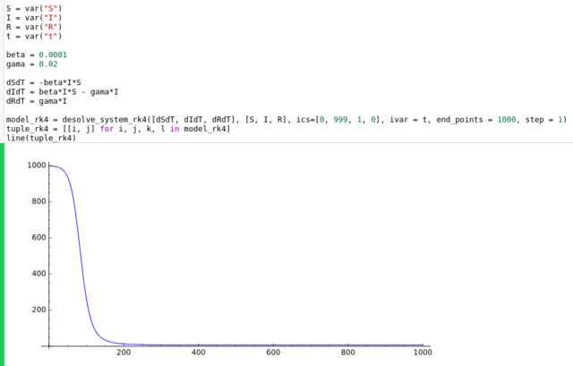
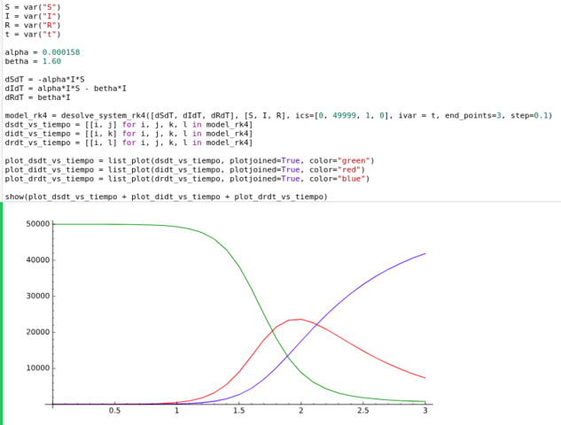

# Statical-models
***
### Description
***
In order to solve some common systems models, a series of scripts has been developed using ipynb and sagews, both based on the Python programming language.
The present repository contains scripts of epidemiological models, predator-prey models, among others.
***
### Images
***
#### Epidemiological model example 1

***
#### Epidemiological model example 2

***
#### Epidemiological model example 3
